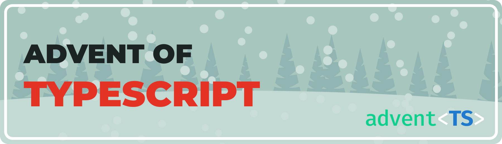

Этот репозиторий содержит мои решения задач [Advent of Typescript](https://www.adventofts.com).

## Решения

<table>
<tr>
<th>2023 год</th>
<th>2024 год</th>
</tr>
<tr>
<td>

| День |                             Задача                             |
|:----:|:--------------------------------------------------------------:|
|  1   |           [Рождественское печенье](./2023/day01.md)            |
|  2   |   [Инвентаризация рождественского печенья](./2023/day02.md)    |
|  3   |             [Упаковщик подарков](./2023/day03.md)              |
|  4   |   [Адреса доставки рождественских подарков](./2023/day04.md)   |
|  5   |          [Организация списка Санты](./2023/day05.md)           |
|  6   |         [Фильтрация детей (часть 1)](./2023/day06.md)          |
|  7   |         [Фильтрация детей (часть 2)](./2023/day07.md)          |
|  8   |         [Фильтрация детей (часть 3)](./2023/day08.md)          |
|  9   |         [Санта страдает дислексией?](./2023/day09.md)          |
|  10  | [Тестер окончания названий улиц на Рождество](./2023/day10.md) |
|  11  |                [Защита списка](./2023/day11.md)                |
|  12  |                 [Найти Санту](./2023/day12.md)                 |
|  13  |                 [Считаем дни](./2023/day13.md)                 |
|  14  |       [Расшифровка списка проказников](./2023/day14.md)        |
|  15  |            [Упаковываем игрушки!](./2023/day15.md)             |
|  16  |            [Найти Санту (часть 2)](./2023/day16.md)            |
|  17  |           [Камень, Ножницы, Бумага](./2023/day17.md)           |
|  18  |          [Оставшиеся доставки Санты](./2023/day18.md)          |
|  19  |        [Помогите Санте отмыть деньги](./2023/day19.md)         |
|  20  |            [TypeScript ASCII Art!](./2023/day20.md)            |
|  21  |         [Что такое Крестики-нолики?](./2023/day21.md)          |
|  22  |                [Судоку оленей](./2023/day22.md)                |
|  23  |      [Connect 4, но на TypeScript типах](./2023/day23.md)      |
|  24  |               [Санта застрял!](./2023/day24.md)                |
|  25  |               [ВЫ СДЕЛАЛИ ЭТО](./2023/day25.md)                |

</td>
<td>

| День |                         Задача                         |
|:----:|:------------------------------------------------------:|
|  1   |     [Олени больше не выдерживают](./2024/day01.md)     |
|  2   |    [Блитцен исправляет беспорядок](./2024/day02.md)    |
|  3   |     [Санта хочет данные о жилье](./2024/day03.md)      |
|  4   | [Бернард представляет данные о жилье](./2024/day04.md) |
|  5   |                                                        |
|  6   |                                                        |
|  7   |                                                        |
|  8   |                                                        |
|  9   |                                                        |
|  10  |                                                        |
|  11  |                                                        |
|  12  |                                                        |
|  13  |                                                        |
|  14  |                                                        |
|  15  |                                                        |
|  16  |                                                        |
|  17  |                                                        |
|  18  |                                                        |
|  19  |                                                        |
|  20  |                                                        |
|  21  |                                                        |
|  22  |                                                        |
|  23  |                                                        |
|  24  |                                                        |
|  25  |                                                        |

</td>
</tr>
</table>

